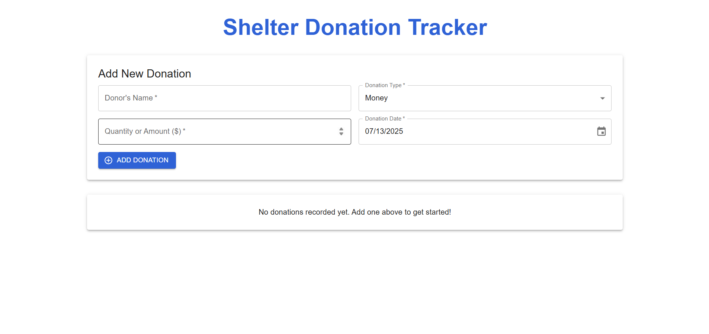

# Shelter Donation Tracker

A full-stack web application built for a local shelter to manage donation inventory. It provides a real-time, user-friendly tool to record, update, and visualize donations accurately.

**Live Application:** [https://donations-test.duckdns.org](https://donations-test.duckdns.org)



---

## Features

- **Full CRUD Functionality**  
  Add, view, edit, and delete donation records seamlessly.

- **Rich User Interface**  
  Clean, responsive UI built with Material-UI (MUI), featuring a data table and donation form with date picker.

- **Advanced Form Validation**  
  Real-time, client-side validation with robust server-side validation via Sequelize.

- **Data Visualization**  
  Interactive pie chart using Recharts to summarize donations by category.

- **Persistent Storage**  
  SQLite database powered by Sequelize ORM for lightweight persistence.

- **Modern Backend**  
  RESTful API built with Node.js and Express.js using ES6 modules.

- **Containerized Deployment**  
  Fully Dockerized using multi-stage builds for optimized production images.

- **Secure & Automated Deployments**  
  - **Caddy Reverse Proxy:** Serves the app with automatic HTTPS via Let’s Encrypt.  
  - **CI/CD Pipeline:** GitHub Actions workflow tests and deploys on every push to the `main` branch.

- **Comprehensive Testing**  
  - Backend: Jest & Supertest  
  - Frontend: React Testing Library

---

## Tech Stack

| Category   | Technology                                                                 |
|------------|----------------------------------------------------------------------------|
| Frontend   | React.js (Vite), Material-UI (MUI), Recharts, Axios                       |
| Backend    | Node.js, Express.js, Sequelize ORM, SQLite                                 |
| Testing    | Jest, Supertest, React Testing Library                                     |
| DevOps     | Docker, Docker Compose, Caddy (Auto-HTTPS), GitHub Actions (CI/CD)        |

---

## Running the Project

You can run the project either locally for development or as a production-ready setup using Docker.

### 1. Local Development (for contributing)

**Prerequisites:**

- Node.js (v18 or later)
- npm

**Backend Setup:**

```bash
cd server
npm install
npm run dev
```

Runs at: `http://localhost:5001`

**Frontend Setup (in a separate terminal):**

```bash
cd client
npm install
npm run dev
```

Opens at: `http://localhost:5173`  
Vite automatically proxies API requests to the backend.

---

### 2. Production Environment (with Docker)

**Prerequisites:**

- Docker
- Docker Compose

**Instructions:**

```bash
# From the root directory
docker-compose up --build -d
```

Access the app:

- With default settings: `http://localhost`
- With DuckDNS: [https://donations-test.duckdns.org](https://donations-test.duckdns.org)

To stop the stack:

```bash
docker-compose down
```

---

## Running Tests

**Backend API Tests:**

```bash
cd server
npm test
```

**Frontend Component Tests:**

```bash
cd client
npm test
```

---

## CI/CD Automation

This project includes a GitHub Actions workflow:  
`.github/workflows/deploy.yml`

**Trigger:**  
Runs on every push to the `main` branch.

**Deployment Process:**

1. Establishes secure SSH connection to the production server via secrets.
2. Pulls the latest code.
3. Stops running containers.
4. Builds and starts new Docker containers.
5. Prunes old images to save disk space.

---

## License

This project is open-source and available under the [MIT License](LICENSE).
